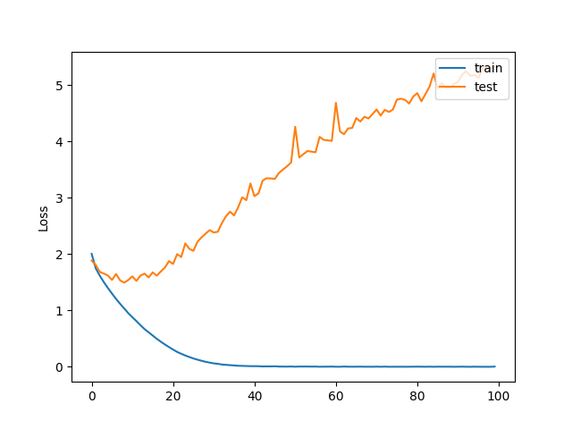

# stl10-testes

### 1 -  Treinamento AE com dados não rotulados

### 2 - Treinamento CNN pequena 

acc: 1.0000 

test_acc: 0.4595

### 3 - Extração de características com MobileNet
Treinamento SVM (features de treinamento)

Teste SVM (features de teste): **score: 0.90325** 

### 4 - Fine-tuning da MobileNet

acc: 0.9992

test_acc: 0.9230

