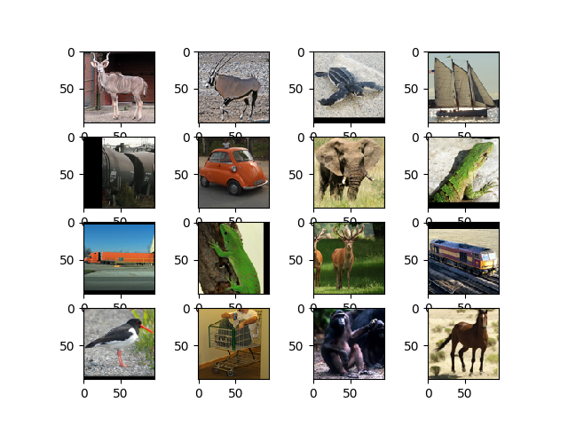
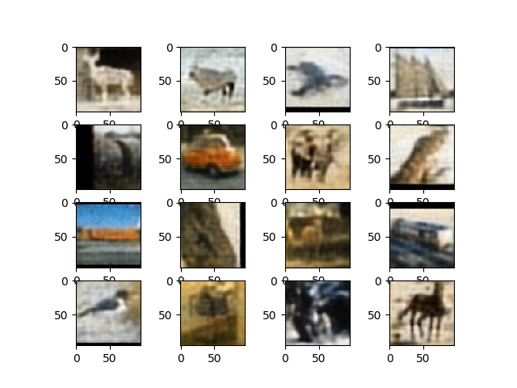
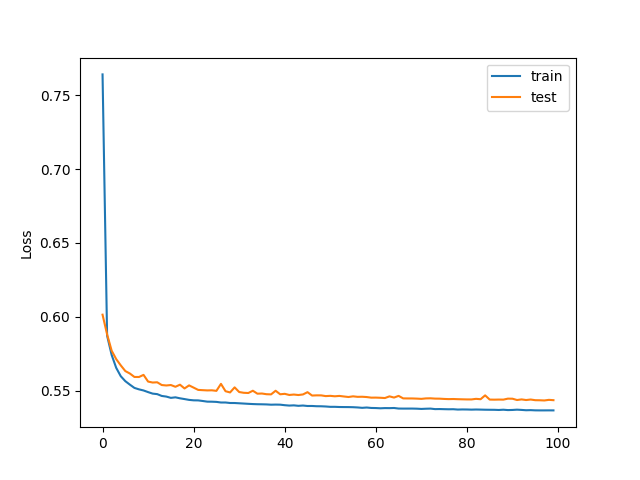
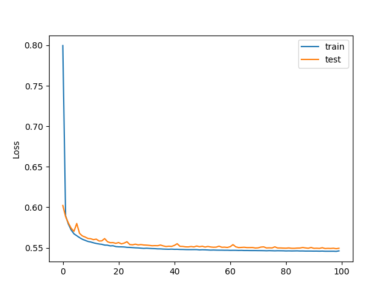
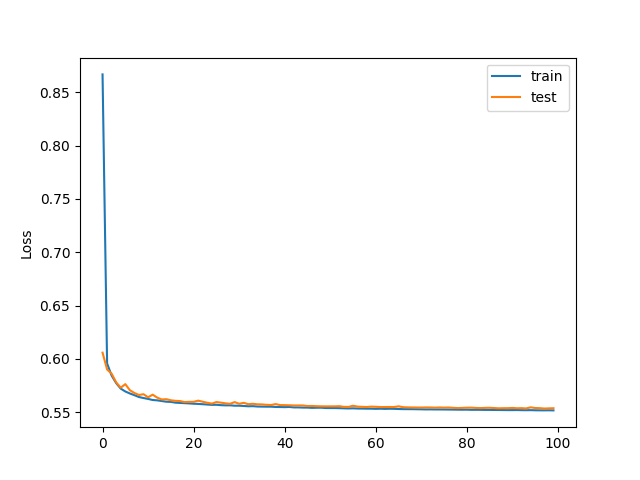
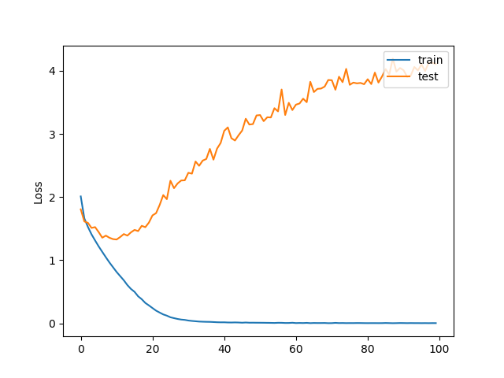

# stl10-testes

### 1 -  Treinamento AE com dados não rotulados

16_1024_adam:

32_2048_adam:

### 2 - Treinamento CNN pequena 

acc: 1.0000 

test_acc: 0.4595

### 3 - Extração de características com MobileNet
Treinamento SVM (features de treinamento)

Teste SVM (features de teste): **score: 0.90325** 

### 4 - Fine-tuning da MobileNet

acc: 0.9992

test_acc: 0.9230

### 5 - Extração de características com MobileNet (do fine-tuning)
Treinamento SVM (features de treinamento)

Teste SVM (features de teste): **score: 0.943** 

### 6 - Treinamento MobileNet no dataset Places

Alternativa: utilizar o modelo já treinado disponibilizado em https://github.com/GKalliatakis/Keras-VGG16-places365 

Treinamento SVM (features de treinamento)

Teste SVM (features de teste): **score: 0.7485** 

-----------------------------------------------------------------
1) 
- Reconstrução:

- Usar as características do AE para treinar a SVM - **score: 0.374625**
- Droput: 0.1, 0.3 e 0.5, respectivamente:

2) CNN-2: 

acc: 0.999
val_acc: 0.5356

